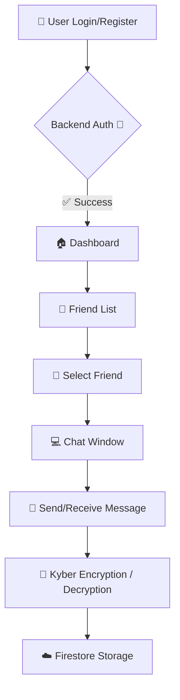
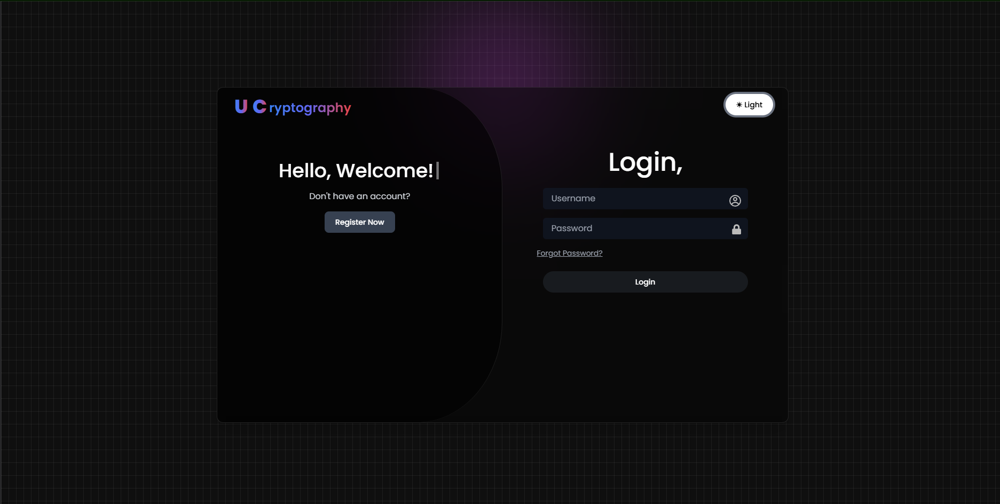
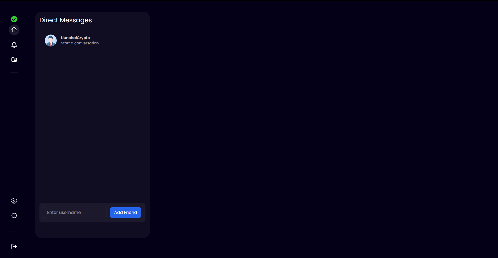
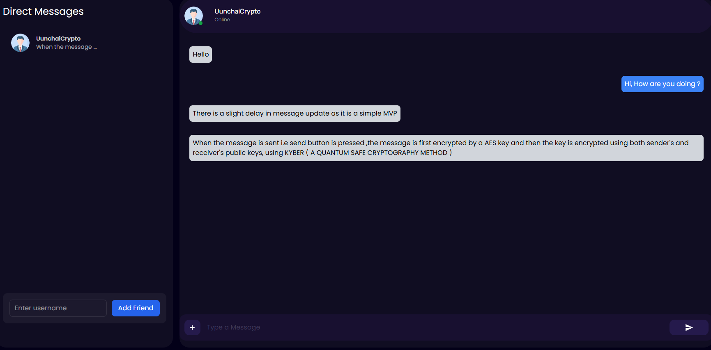

# 🌟🚀 **PQMessenger** — *Next-Gen Secure Messaging*

Welcome to **PQMessenger**, a cutting-edge, **post-quantum secure** chat application that blends **military-grade cryptography** with a sleek, modern interface. Built with **React** on the frontend and **Python Flask** on the backend, it ensures your conversations remain private and future-proof. 💬🔒

---

## 📂 **Project Structure**

```bash
backend/
  ├── app.py
  ├── kyber.py
  ├── libkyber.dll / libkyber.so
  ├── requirements.txt
  ├── models/
  ├── routes/
frontend/
  ├── src/
  │   ├── Components/
  │   ├── ComponentsCss/
  │   ├── context/
  │   ├── Routes/
  │   ├── utils/
  │   ├── Wrapper/
  ├── public/
  ├── package.json
```

---

## 🌟 **Features at a Glance**

* 🔒 **Post-Quantum Encryption** — Powered by Kyber KEM for ultimate future-proof security
* ⚡ **Real-Time Messaging** — Instant delivery with smooth transitions
* 👥 **Friend Management** — Add, accept, and track friends easily
* 🛡️ **Secure Auth** — JWT + Firebase + Redis sessions
* 🎨 **Polished UI** — Dark/light modes, responsive, mobile-ready
* 📱 **Cross-Platform** — Looks and works great on all devices

---

## 🛠 **Tech Stack**

**Frontend:** React, Tailwind CSS
**Backend:** Python Flask, Firebase, Kyber, Redis
**Database:** Firestore
**Icons:** React Icons

---

## ⚡ **Quick Start Guide**

### 1️⃣ Clone the Repository

```bash
git clone https://github.com/uunchaicrypto/pqmessenger.git
cd pqmessenger
```

### 2️⃣ Install dependencies
```bash
cd backend
pip install -r requirements.txt
cd ../frontend
npm install
cd ..
```
#### 🔐 Kyber Shared Library (Required)
Checkout the [README](KyberCompilation/README.md) file under the **KyberCompilation** folder for instructions on compiling the shared library .

#### 🔴 Redis Setup (Required)

1. **Install Redis**
   * 🐧 Linux: `sudo apt install redis-server`
   * 🍎 Mac: `brew install redis`
   * 🪟 Windows: Use [Memurai](https://www.memurai.com/) or WSL
2. **Start Redis**
   ```bash
   redis-server
   ```
3. **Integrate in Flask**
   ```python
   import redis
   redis_client = redis.StrictRedis(host='localhost', port=6379, db=0)
   ```
4. **Purpose:** Stores **active sessions**, **ephemeral keys**, and **private data** securely in memory.


### 3️⃣ Start the app (Windows)
**Make sure your Redis server is online before starting!**

You can use the provided `script.bat` to start both frontend and backend automatically in separate terminals:

```bash
script.bat
```

This will:
- Show a big warning to ensure Redis is running
- Start the frontend (`npm run start`) in one terminal
- Start the backend (`python app.py`) in another terminal

You can also start them manually if you prefer:
```bash
cd backend
python app.py
cd ../frontend
npm start
```

---

## 🔗 **System Flow**



---

## 📸 **Screenshots**

| Login                            | Dashboard                        | Chat                            |
| -------------------------------- | -------------------------------- | ------------------------------- |
|  |  |  |

---

## 🧩 **Folder Details**

* **backend/** — Flask server, Kyber crypto engine, Redis integration
* **frontend/** — React app, components, routes, state management
* **models/** — User, friend, and message data schemas
* **public/** — Static assets and icons
* **KyberCompilation/** — Method to compiled a shared kyber library in `.dll` for windows. 

---
<!-- 
## 🤝 **Contributing**

We ❤️ pull requests! Please open an issue before making major changes.

--- -->


## ✨ **Happy Secure Messaging!** 🔐💌
